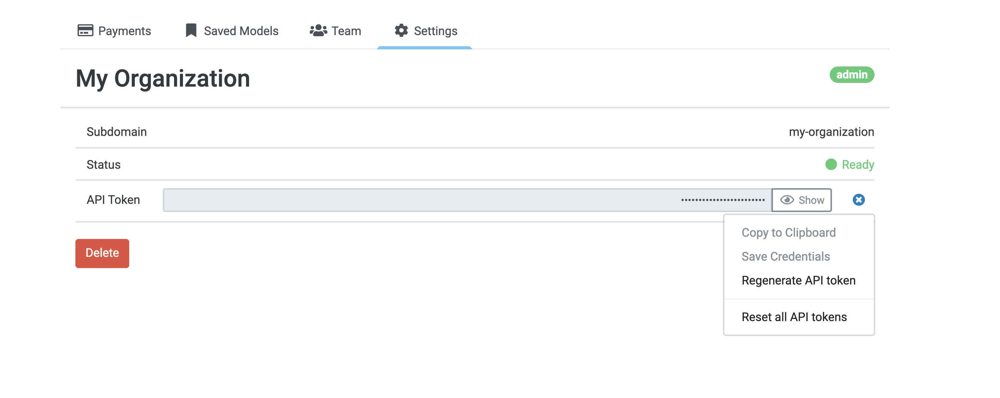
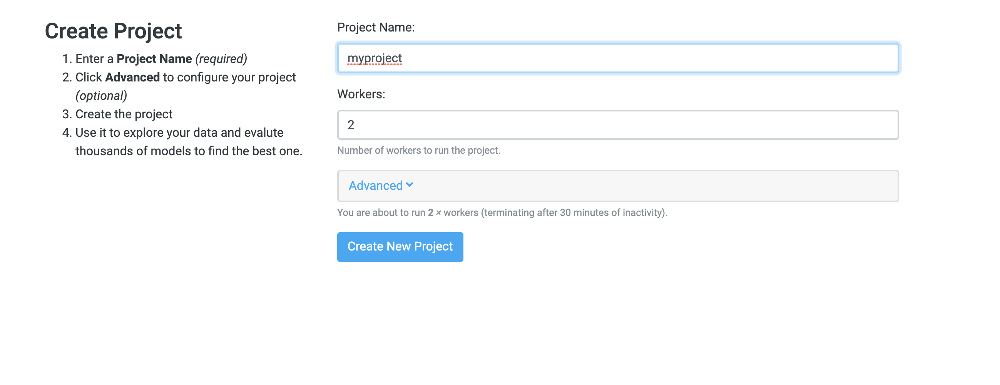
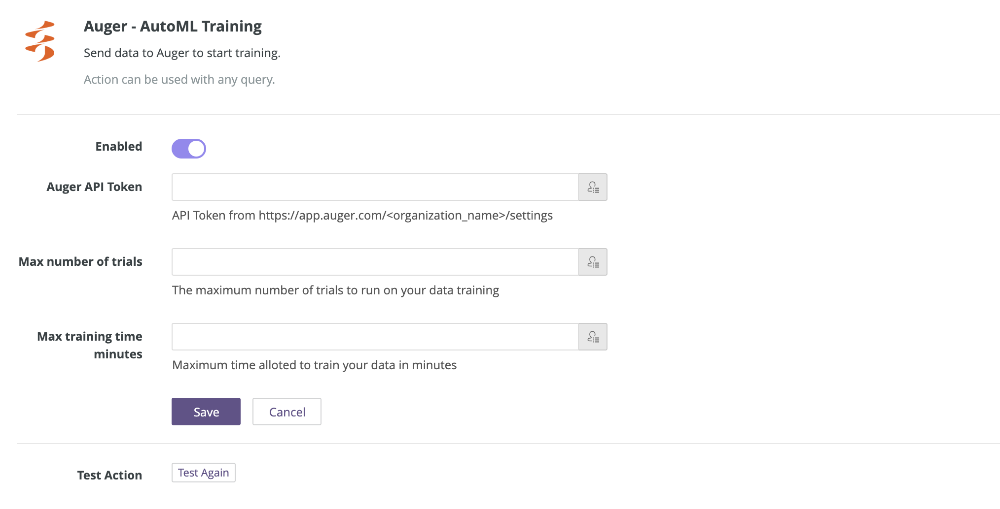
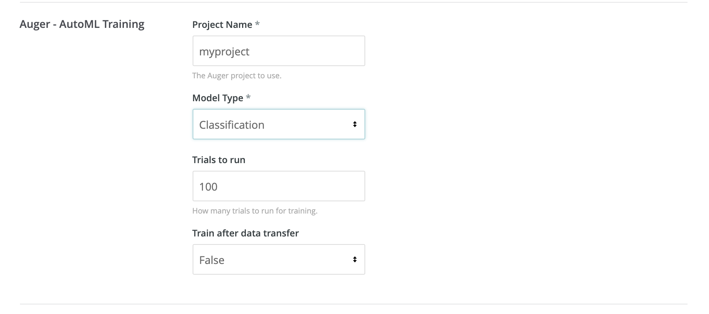

# Auger

This action takes a query result and uses it to run the industries most accurate Automated Machine Learning to build a predictive model.

## Setup

1. Enable Auger in your Looker Administration page for Actions (/admin/actions).
    - If you haven't already set up an organization in Auger, [do that first](https://app.auger.ai).
    - Get the API Token for your Auger organization. 
    - Create a project in your Auger organization. 
    - Enter the token into Looker Action Hub. 
    - Enter max number of trials or leave blank. If you are automatically initiating training on your dataset from Looker this is how many trials you will run. If left empty default is 100.
    - Enter max training time minutes or leave blank. If you are automatically initiating training on your dataset from Looker this is how long you will run training for. If left empty default is 60 minutes.

## Using the Auger Action

When you use the Auger Action in Looker, Looker does two steps:

1. It transfers your query data to your Auger project.
2. Optionally, if selected, it will start machine learning training using your dataset.

To use this Action, run a query in Looker with all the fields that you want to send to Auger. **IMPORTANT: Auger assumes the last column in your query is the target.**

1. Run a query to generate the rows you want to transfer to Auger.
2. Click the gear icon, choose Send..., then choose Auger as the destination.
3. Scroll down to 'Advanced options' and expand to click a limit of 'All Results' instead of Results in table to send all your data.
4. Enter the project name of the Auger project you want to transfer your data to.
5. Enter the model type that you will be predicting on.
7. Enter 'Trials to run' to override any value entered in admin screen.
6. Train after data transfer is set to False. This means you would need to go into Auger to trigger training. Set to true if you want to autmatically start training after transfer.
7. Hit send and let the magic happen.

## Things to know

- The last column in your query will be used as the target.
- All other columns will be treated as features if you set 'Train after data transfer' to True. If left to False you can manually choose your features.
- Any features/target with 1 unique value or unique values equal to number of rows will be left out. It is recommended to send 'All Results' from the 'Advanced options' section.
- If 'Train after data transfer' is set to True you will get an email when training finishes with a link to your leaderboard results.
