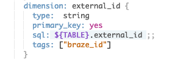

# Braze
## Sends data to Braze via REST API
The Braze actions enables you to flag users within Braze via the [Rest API Endpoint](https://www.braze.com/docs/developer_guide/rest_api/user_data/#user-track-request) from a Looker look. This actions requires that a dimension is tagged with `braze_id`.  The action will append the flagged value to the user's `looker_export` custom attribute.
**Only existing users will be flagged.**
**Does not work with pivoted data**

## Setup Instructions
  1. Create an Rest API key with access to `user.track` from the [Braze Developer Console](https://dashboard.braze.com/app_settings/developer_console/) 
  2. Setup the Braze Looker Action with the API Key, and [Braze Rest Endpoint](https://www.braze.com/docs/developer_guide/rest_api/basics/#endpoints) 
  3. Within Looker develop:
     1. Select the appropriate views.
     2. Add `braze_id` to the dimensions tag.
     3. 

## Usage
  1. Within a look with a `braze_id` dimension selected, click the Settings () on the upper right, and select `Send...`
  2. Select the Custon Braze Action
  3. From the drop down, select the appropriate Unique User Key for the Braze account. Possible settings:
    * external_id
    * user_alias
    * braze_id
  4. Give the export a name. If none is provided, `LOOKER_EXPORT` will be used.
  5. Advanced options: Select `Results in Table` or `All Results`
  6. Click Send.
  7. 

### Braze Dashboard
If the export was correctly sent, then the user's custom attribute `looker_export` should now be set.


### Braze Segments
To target the flagged users, a Braze Segments can be created that matches the flagged value.


## Limitations
  * Only works with non-pivoted data.
  * Currently, the api is limited to 10,000 rows sent.
  * Final count of user's flag maybe be lower due to duplicates or non-users.  

## Sample Outgoing API
Sample of the Outgoing API which will be sent to the [/user/track/](https://www.braze.com/docs/developer_guide/rest_api/user_data/#user-track-request) endpoint.
```
{
   "api_key" : "[API_KEY]",
   "attributes" : [
      {
        "external_id" : "user_01",
        "_update_existing_only" : true,
        "looker_export" : { "add" : ["LOOKER"] }
      },
      {
        "external_id" : "user_02",
        "_update_existing_only" : true,
        "looker_export" : { "add" : ["LOOKER"] }
      },
      {
        "external_id" : "user_03",
        "_update_existing_only" : true,
        "looker_export" : { "add" : ["LOOKER"] }
      },
      .....
   ]
}
```
