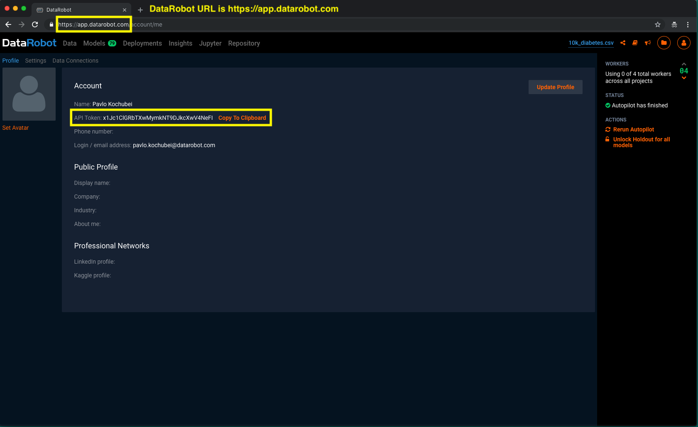

# DataRobot
## Send data from a Look to DataRobot for analysis.

This action allows you to export data into DataRobot from a Look.
 
### How to enable DataRobot Action?
1. Got to your Looker Admin page (/admin). 
2. Create a user-attribute that will hold DataRobot API token.
3. Enable DataRobot Action in Actions tab (/admin/actions).
4. Select the user-attribute you've created to be used as Authentication User Attribute.
5. Enter DataRobot URL (for example: https://app.datarobot.com).
6. You're all set. The DataRobot Action will appear as an option when you export data from your Looks.

### Where to find your DataRobot credentials?
Go to the Profile page of your DataRobot application. For example, https://app.datarobot.com/account/me.
You'll need to copy your API Token to a attribute field in Looker. You'll also need to grab your application URL.
For example: https://app.datarobot.com.

