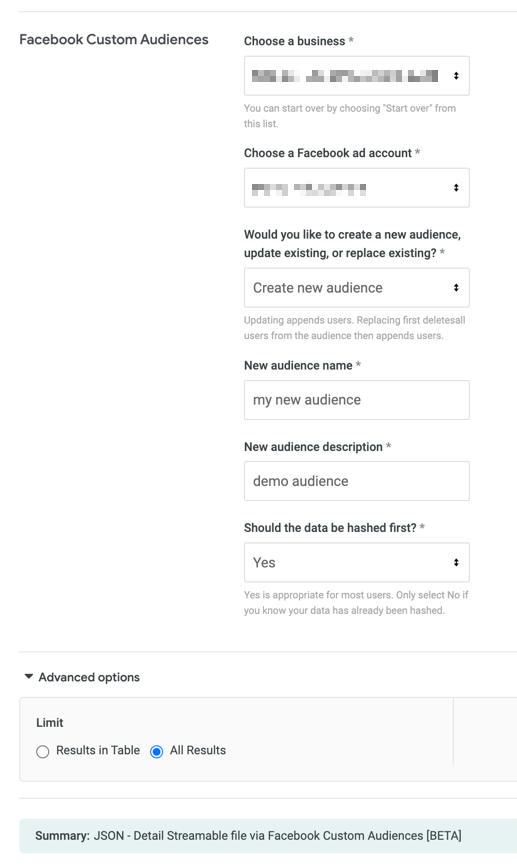

# Facebook Custom Audiences

## Send data to Facebook Custom Audiences

The Facebook Custom Audiences Action enables you to create audiences based on your first-party data and send them to Facebook Ads Custom Audiences. You authenticate with your Facebook account and then you're able to send one-off or recurring uploads to a [customer list Custom Audience](https://www.facebook.com/business/help/744354708981227?id=2469097953376494).

## Enable the action

A Looker admin must enable this action by following these steps:

1. Navigate to the [**Actions** page](https://docs.looker.com/admin-options/platform/actions) from the Looker **Admin** panel.
1. Next to the **Facebook Custom Audiences** action, click **Enable**. Click the **Refresh** button if the actions do not appear in the list.
1. Switch on the **Enable** toggle and click **Save**.


Once enabled, this action will show up as a destination option for data deliveries in the Scheduler.

## Configuring your Looker report

Before you can use the Facebook Custom Audiences action, you must ensure that the columns in your Looker report map correctly to the [user identifiers](https://developers.facebook.com/docs/marketing-api/audiences/guides/custom-audiences/#hash) in Facebook Ads.

There are two ways to match your report data to the correct identifiers:

### Option 1: Match using LookML field tags

This action will first try to match your fields by tags. These tags are case insensitive:

```
email
phone
birth_year
birth_month
birth_day
last_name
first_name
first_initial
city
state
zip
country
mad_id
external_id
```

### Option 2: Match using regex

Any report fields which do not match on tags will fall back to a regex match using the pattern below. These regex conditions are also case insensitive:

```
[/email/i, "EMAIL"],
[/phone/i, "PHONE"],
[/year/i, "DOBY"],
[/month/i, "DOBM"]
[/day/i, "DOBD"],
[/last/i, "LN"],
[/first/i, "FN"],
[/initial/i, "FI"],
[/city/i, "CT"],
[/state/i, "ST"],
[/postal|zip/i, "ZIP"]
[/country/i, "COUNTRY"],
[/madid/i, "MADID"],
[/external/i, "EXTERN_ID"]
```

**Any field which fail to match on tags or regex will be omitted from the upload to Facebook Ads.**

If your columns do not match any identifiers, a LookML developer can:

- Update the field's [tags](https://docs.looker.com/reference/field-params/tags) to include a matching tag
- Update the field's [label](https://docs.looker.com/reference/field-params/label-for-field) in the report's LookML to match on regex

Alternatively, you can create a [custom field](https://docs.looker.com/exploring-data/adding-fields/custom-measure) from the Explore to duplicate the column and give it a new label.

## Preparing your data to send to Facebook Ads

Facebook Ads expects your data in a specific format, otherwise matches may fail. While it's normal for some matches to fail, you can maximize your audience matching by making sure your data is in the correct format.

Facebook specifies the exact formats for each field [here](https://developers.facebook.com/docs/marketing-api/audiences/guides/custom-audiences#hash).

By default the integration will try to format phone numbers, names, and dates. It will also attempt to lookup state and country codes for you. If your data is in an unusual format this automatic formatting may fail.

_Note: If you have already hashed your data, the integration cannot do any formatting for you. Unless you know your data is already hashed, this limitation won't affect you._

# Sending data to Facebook Custom Audiences

You can send data from Explores and Looks to the Facebook Custom Audiences action destination from the Looker Scheduler.

> Make sure that you have accepted the **Custom Audience Terms of Service** and that your Facebook Ads account meets the minimum criteria before using this Looker integration. You can read about the general setup for custom audiences [here](https://developers.facebook.com/docs/marketing-api/audiences/reference/custom-audience-terms-of-service).

From your selected Explore or Look, click the gear menu in the upper right corner. For Looks or Explores, select **Send** for one-time deliveries. For Looks, select **Schedule** for recurring deliveries. For Explores, because there is no option to send a recurring delivery, you must select **Save & Schedule** to first save the Explore as a Look and then schedule the Look for a recurring delivery.

> For more information about scheduling data deliveries, see the [Using the Looker Scheduler to deliver content](https://docs.looker.com/sharing-and-publishing/scheduling-and-sharing/scheduling) documentation page.

Selecting a delivery option opens the Scheduler for Explores and Looks. Enter a title for your delivery. To deliver to the Facebook Custom Audiences destination:

1.  Select the **Facebook Custom Audiences** icon from the **Where should this data go?** section of the Scheduler.
1.  The first time you deliver to this destination, you must authenticate with your Facebook OAuth credentials. In the **Facebook Custom Audiences** section of the Scheduler, click the **Log in to Facebook** button:

    

1. You will be presented with a consent screen for the Facebook account you are currently logged in as. If you are not logged in to Facebook, you will need to log in to an account associated with a Business and Ads account. Click **Continue**:

    

1. Looker will request the permission to manage ads for ad accounts that you have access to and to manage your business. If you have access to more than one businesses, you can select which business to allow access by clicking **Choose what you allow**:

    

1.  Looker will need both permissions for the action to function (which should be selected by default), however if you want to remove access to a specific business account you can deselect it from the list. Click **Continue**. If your login is successful, you will see a message to close the browser tab and return to the Scheduler.

    

    > Note: Looker will need access to a minimum of 1 business account

1.  Back in the **Facebook Custom Audiences** section of the Scheduler, click the **Verify credentials** button.
1.  Select your ads account from the **Choose a Facebook ad account** drop-down.
1.  Choose whether to create a new audience, append to an existing audience, or replace an existing audience. Creating a new audience or updating resets your ads to the "learning" stage. Replacing does not.

    > Replacing will first delete all users from the selected audience and _then_ add new users.

    1. If you select **Update existing audience** or **Replace existing audience**, pick which audience you want to append to from the following drop-down.
    1. If you select **Create new audience**, enter values for the name and description.

1.  Determine if you want the data to be hashed prior to delivery. All personal data must be normalized and hashed before uploading to Facebook Ads. If your data is not yet hashed, select **Yes** and Looker will attempt to hash the data according to Facebook Ads requirements. If you select **No**, then the data will be sent as it appears in Looker, which means that the data should already be normalized and hashed within your database.

    > If the data is not hashed correctly, your customer list will not match any audiences in Facebook Ads.

1.  For recurring deliveries, set the trigger for the delivery. For **Repeating interval** triggers, set the frequency with which you would like to deliver this data. For **Datagroup update** triggers, choose the triggering datagroup from the **Select Datagroup** drop-down. Apply any additional filters to the scheduled delivery in the **Filters** section of the Scheduler.
1. Expand the **Advanced options** menu in the Scheduler. *Make sure to select **All Results***. For recurring deliveries, select any additional scheduling conditions you would like to place on the delivery.
1. Review your delivery settings. For one-time deliveries, click **Send**. For recurring deliveries, click **Save All**.

    

# Troubleshooting

- If your Facebook Ads account has never run an ad, Facebook may require you to run ads without incident for two weeks before using this feature.
- Look for account errors or restrictions in your Facebook business [Ads Manager dashboard](https://business.facebook.com/adsmanager).
- If matches are failing through the integration, attempt a manual upload of a custom audience list using the [Facebook audience tools](https://www.facebook.com/adsmanager/audiences) to get detailed feedback on why matches aren't working.

# Removal

- To uninstall the Looker action, go to your Facebook account's [business integration settings page](https://www.facebook.com/settings?tab=business_tools&section=active) and click **Remove** for the Looker application:

    

- The next time the form modal is loaded from inside Looker, the login to Facebook button will appear and you will be prompted to authenticate with your Facebook OAuth credentials again.


