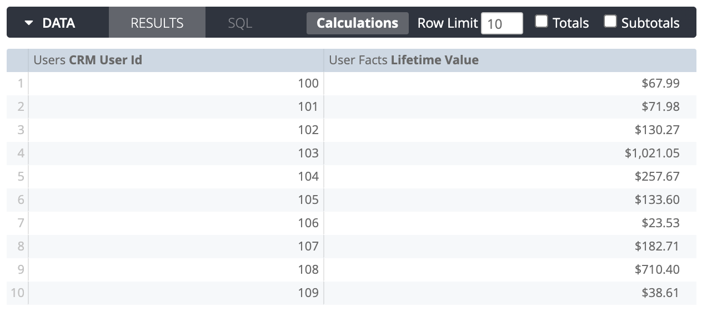
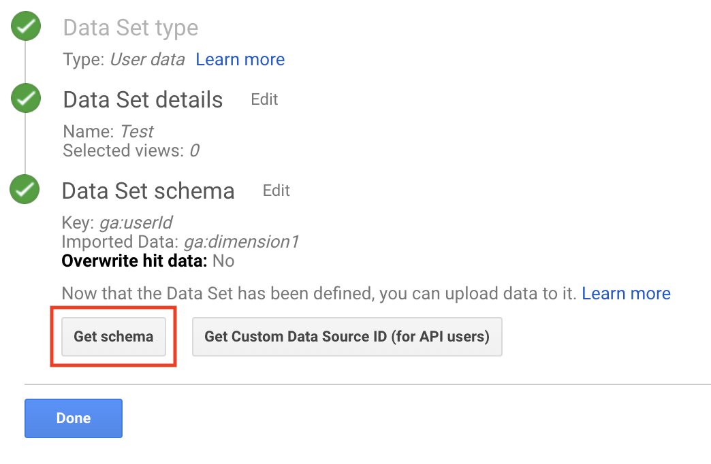

# Google Analytics - Data Import
## Upload data to a GA Data Set

The GA Data Import action allows you to upload data to an existing Data Set within your GA property.

Before using the action there are a number of setup steps to complete within Google Analytics. This implementation guide is an excellent walkthrough: [Importing User Data to create Google Ads Remarketing Audiences](https://developers.google.com/analytics/solutions/data-import-user)

To summarize:
1. If you want to use the enriched data to create remarketing audinces, link your Google Ads account to the Google Analytics account if not done so already.
1. Create any new custom dimensions that you will supply data for, if needed.
1. Create a new custom Data Set, which specifies the schema of the csv data.
1. When the guide refers to preparing csv data, that is where we can use a Looker report. And instead of manually uploading the file to the Data Set, that is where we can use this action.
1. The remainder of the guide explains how to leverage the uploaded data to create reports, segments, and remarketing audiences.

## Create Looker Report

Create a Looker report that matches the schema of the custom data set. The column names don’t matter, but the number of columns and their ordering has to match exactly. Following the CRM example from the implementation guide, the report would look something like this:

Note: any formatting applied by the “value_format” or “html” LookML parameters - such as the dollar sign in this example - will be omitted from the final csv output. You can use custom dimensions & measures in the report but should avoid using table calculations.

To make a one-time upload of this data to Google Analytics, go to the Looker gear menu and select Send. For “Where should this data go” select the “Google Analytics Data Import” option.

The first time you use the action you will see a “Log In” button. Press this button to begin the OAuth login flow which will grant Looker permission to use Google Analytics on your behalf.

Once you return to Looker and click the “Verify Credentials” button (or re-open the dialog), you will be presented with three configuration options:

The first item is a list of all Data Sets in all the properties to which your user has access. Select the one that you want to use. If the list is empty, make sure your Google Analytics account has active Data Sets, and that your user has access to use them.

For the "Data Set Schema" input box, paste in the schema for the chosen Data Set. Looker will use this string as the header row for the csv data, just as shown in the implementation guide. You can retrieve the schema by viewing the Data Set within GA and pressing the “Get Schema” button. [A limitation with the GA API prevents Looker from automatically retrieving the schema. In the future this step may not be necessary.]

Finally, choose whether you would like Looker to automatically clean up any previously uploaded files in this data set. Use this option if each of your uploads always includes the full data set available, meaning that the old files are redundant and out-of-date.

**Note:** Be sure to expand the “Advanced Options” and decide whether you want to send just the “Results in Table” or “All Results”. The Looker web UI is limited to showing only 5000 results in the table. However, this action is able to stream data from Looker (and typically your analytics database in turn as well) so you can efficiently send more than 5000 rows if needed. However, GA Data Set uploads cannot exceed 1 GB in file size.

Once you press Send the dialog will close and the process will kick off. When the process is complete you will see a new upload in the “Manage Uploads” section for the Data Set within GA. Note: due to an API limitation the file name will appear as “Unknown filename”.

If you would like to upload this report on a recurring basis, simply save the report as a Look and use the “Schedule” menu. “Google Analytics Data Import” will appear as a destination for schedules as well.
