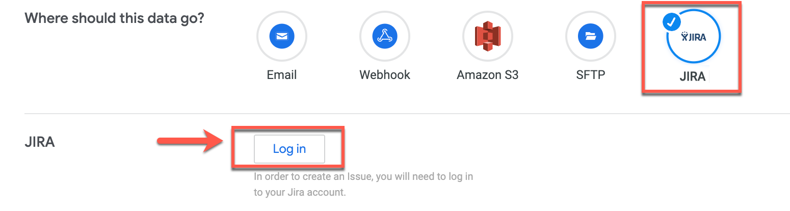
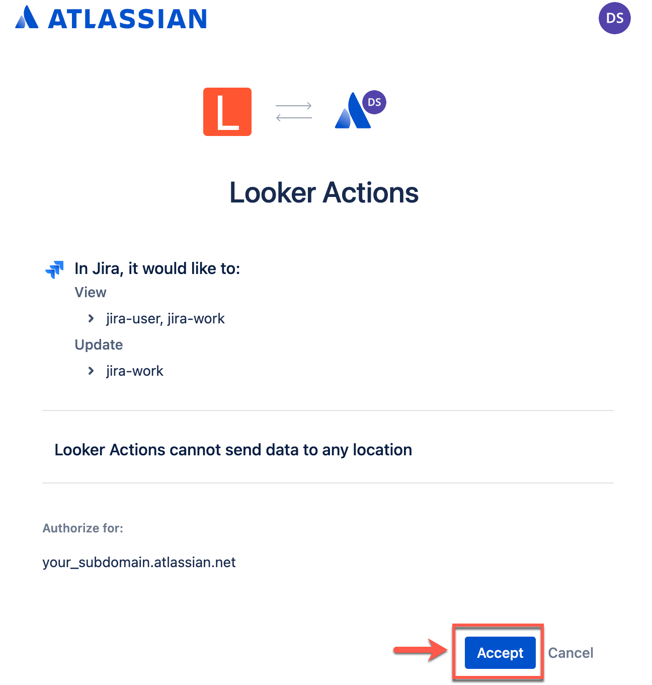
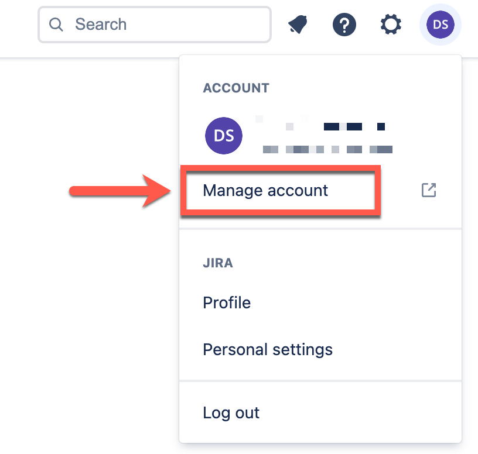
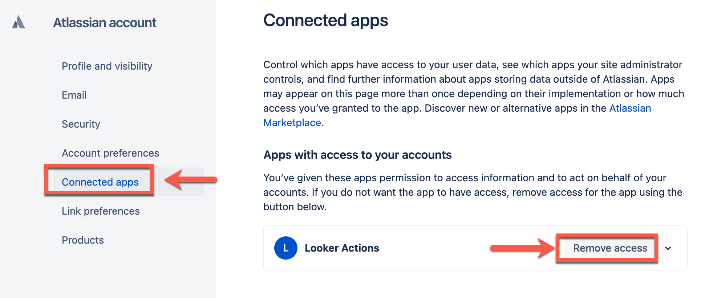

# JIRA
## Create a JIRA issue referencing data

This action will create a JIRA Issue referencing data from a Looker Explore query or Look.

## Sending data to JIRA

From your selected Explore or Look, click the gear menu in the upper right corner. For Looks or Explores, select **Send** for one-time deliveries. For Looks, select **Schedule** for recurring deliveries. For Explores, because there is no option to send a recurring delivery, you must select **Save & Schedule** to first save the Explore as a Look and then schedule the Look for a recurring delivery.

> For more information about scheduling data deliveries, see the [Using the Looker Scheduler to deliver content](https://cloud.google.com/looker/docs/scheduling) documentation page.

Selecting a delivery option opens the Scheduler for Explores and Looks. Enter a title for your delivery. To deliver to Jira destination:

1.  Select the **JIRA** icon from the **Where should this data go?** section of the Scheduler.

1.  The first time you deliver to this destination, you must authenticate with your Atlassian OAuth credentials. In the **Jira** section of the Scheduler, click the **Log in to Jira** button:

    

1. You will be presented with a consent screen to grant the Looker application the scope to view `jira-user` and view/update `jira-work`. Click **Accept**:

    

1. Back in the Jira section of the Scheduler, click the Verify credentials button.

1. Select your project from the drop-down field and fill out the remaining fields.

## Description of Form Fields

1. `Project` (_required_) - The project selection determines the Jira project where the new Jira ticket will be created. The list of projects is pulled from the authenticated user's Jira instance and the projects therein. 

1. `Issue Type` (_required_) - these are the different types of issues a user can create for a given project. The issue type is required and the selection options are pulled from the selected project. Only issue types supported by a given project will be displayed. Issue types are `bug` or `task` or the like. Some custom issue types are supported, inclunding `epic` and `subtask`. 

1. `Summary` (_required_) - this will be the name of the ticket.

1. `Description` (_optional_) - this is an optional text field. If you give your ticket a description here, it will show up in the newly created Jira ticket after you save. 

1. `Filename` (_optional_) - The filename will be the name of the data plot that gets attached to your new Jira ticket. If you leave it blank, a name will be used based on the action hub's suggestion (see `ActionRequest.suggestedFilename`). 

1. `Parent Issue` - this field is only required (and only shows up) if you choose to create a new Jira issue with the issueType `subtask`. Subtask issue types require a linked parent issue. This field is populated by pulling all `standardIssueTypes` from the selected project. The user can select the parent issue from this list. 

1. `Epic Name` - if the selected project supports epic issue types and the `epic` issue type is selected, this field shows up and is required. It will determine the name of the new epic being created. Because epic is a custom field, the project's field name id for epic name is retrieved from Jira before setting it with the text value of this field.

## Removal
To uninstall the Looker action, go to your Atlassian account's [Connected apps page](https://id.atlassian.com/manage-profile/apps) and click **Remove access** for the Looker application. You can get to this page by:

1. Select your profile icon in the top-right corner, and from the dropdown, select to "Manage Account":

1. Select the "Connected apps" page, then click "Remove access":

The next time the form modal is loaded from inside Looker, the login to Jira button will appear and you will be prompted to authenticate with your Atlassian OAuth credentials again.
