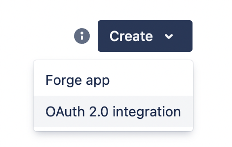
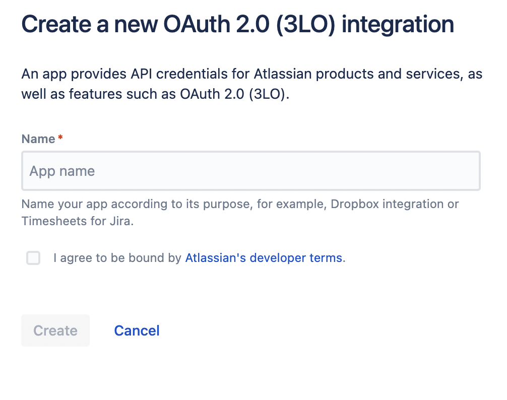
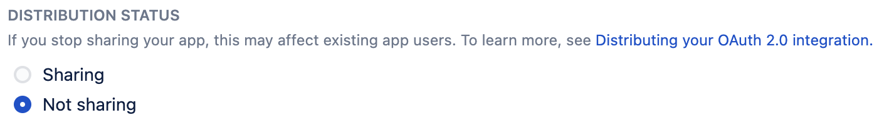
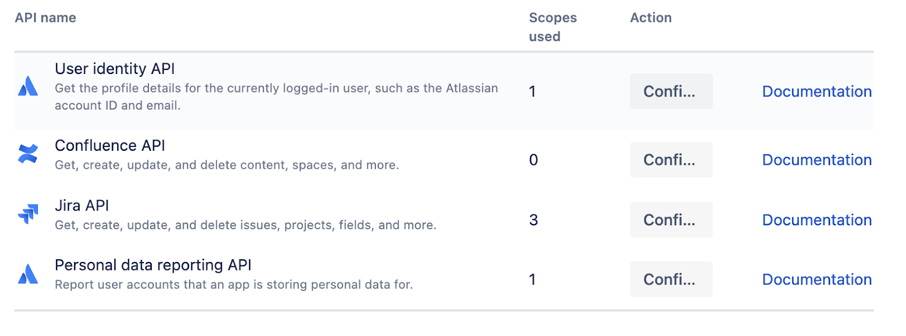
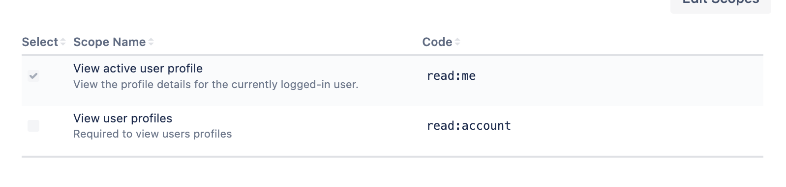
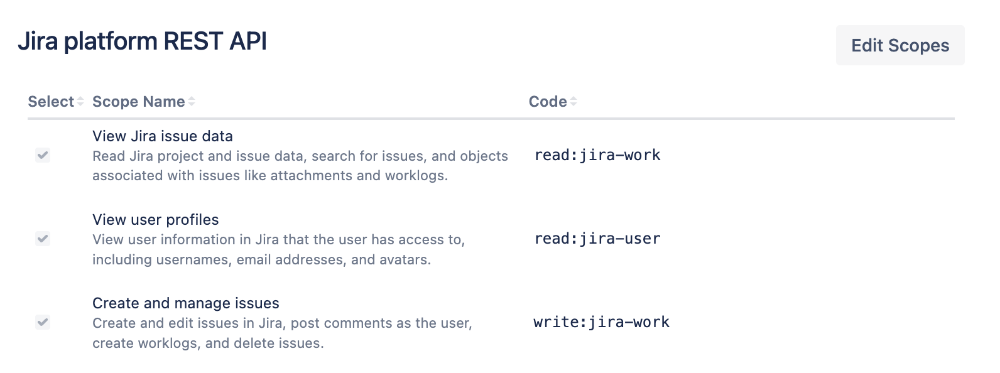
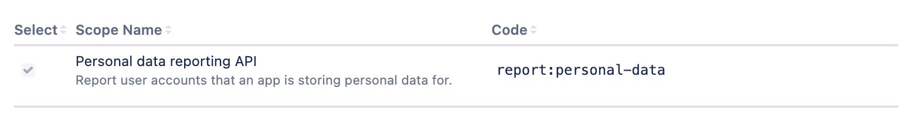
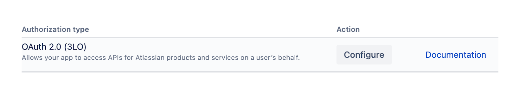

# JIRA
## Create a JIRA issue referencing data

This action will create a JIRA Issue referencing data from a Look. 
In order to enable the action, you need a `JIRA_CLIENT_ID` and `JIRA_CLIENT_SECRET` in your action hub enviornment file. To properly set that up, follow the steps in JIRA Action Oauth Setup.
Once you have completed the Oauth setup, trigger the JIRA action just like you would any other. When prompted, `login` with your JIRA username and password and then `verify credentials` and then you can start creating tickets. 

## JIRA Action Oauth Setup

1. Create a JIRA account or use the account you want your action hub tickets to be associated with.

2. Navigate to the Atlassian developer console https://developer.atlassian.com/console/myapps/

3. Click the create button to create an “OAUTH 2.0 Integration” 


4. Name your app and agree to the terms


5. Click on the “Distribution” tab then the “Edit” button. Then make sure your app’s “Distribution Status” are set to “Not Sharing”. Save your changes.


6. Click on the “Permissions” tab. 


7. Click “Add” or “Configure” for “User Identity API”. Click “Edit Scopes” and select “View active user profile”


8. Click “Add” or “Configure” for “Jira API”. Click “Edit Scopes” and select “View Jira issue data”, “View user profiles”, and “Create and manage issues”


9. Click “Add” or “Configure” for “Personal data reporting API”. Click “Edit Scopes” and select “Personal data reporting API”


10. Click the “Authorization” tab. Click “Add” or “Configure” for “OAuth 2.0 (3LO)”


11. Enter your callback url for your action hub. ie. `https://your_https_web_hosted_address.com/actions/jira_create_issue/oauth_redirect`

12. Make sure all changes have been saved. Then click on the “Settings” tab and scroll to “Authentication Details”. Here you have your app’s client id and secret.

13. Copy and paste the client id and secret into the .env file in your local action hub repo.
```
JIRA_CLIENT_ID=client id
JIRA_CLIENT_SECRET=secret
```

## Description of Form Fields

1. `Project` - this field is required. The project selection determines the jira project where the new jira ticket will be created. The list of projects is pulled from the authenticated user's jira instance and the projects therein. 

2. `Issue Type` - these are the different types of issues a user can create for a given project. The issue type is required and the selection options are pulled from the selected project. Only issue types supported by a given project will be displayed. Issue types are `bug` or `task` or the like. We support some custom issue types as well as `epic` and `subtask`. 

3. `Summary` - this will be the name of the ticket. It is a string and it is required.

4. `Description` - this is an optional text field. If you give your ticket a description here, it will show up in the newly created jira ticket after you save. 

5. `Filename` - this is not required. The filename will be the name of the data plot that gets attached to your new jira ticket. If you leave it blank, a name will be used based on the action hub's suggestion (see `ActionRequest.suggestedFilename`. 

6. `Parent Issue` - this field is only required (and only shows up) if you choose to create a new jira issue with the issueType `subtask`. Subtask issue types require a linked parent issue. This field is populated by pulling all `standardIssueTypes` from the selected project. The user can select the parent issue from this list. 

7. `Epic Name` - if the selected project supports epic issue types and the `epic` issue type is selected, this field shows up and is required. It will determine the name of the new epic being created. Because epic is a custom field, we pull the project's field name id for epic name from jira before setting it with the text value of this field.