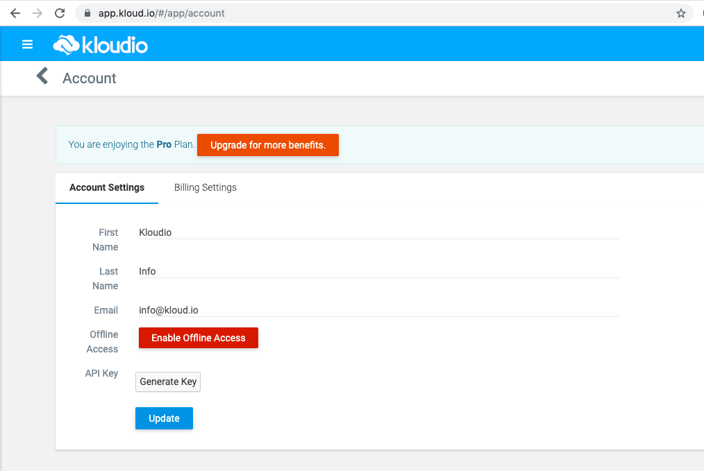
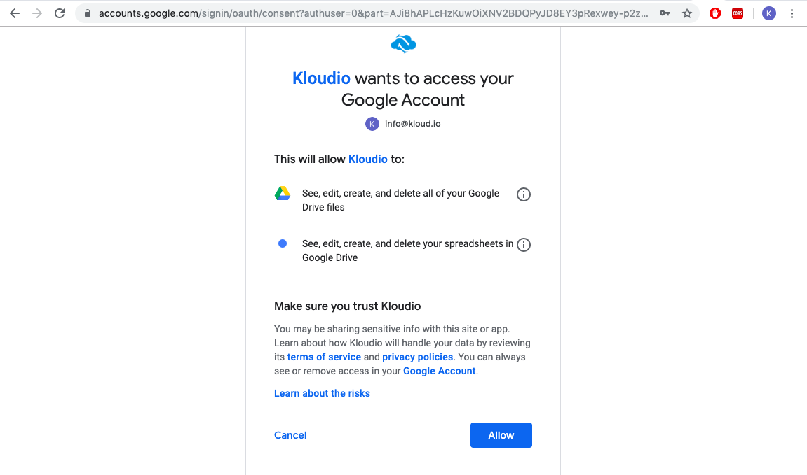
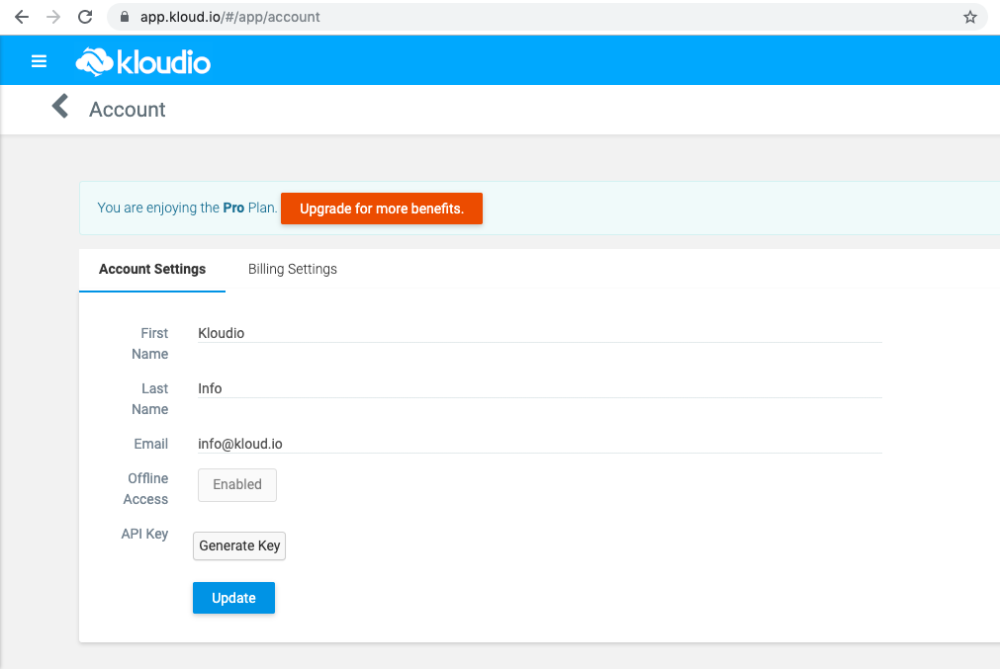
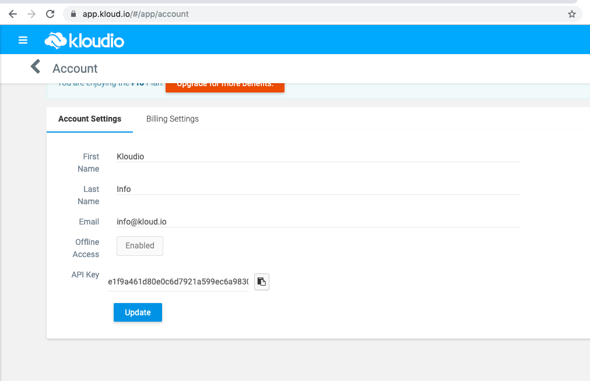

# Kloudio
## Push records to a Google Sheet.

1. Visit [Kloudio's Account Page](https://app.kloud.io/#/app/account).

2. Enable Office Access to Google Sheet by clicking on the "Enaable Offline Access" button. Log in with Google Account having access to the desired Google sheet(s).

3. Now you should see the "Enabled" button in the Accounts page as seen below. Now click on the "Generate Key" button in the Accounts Page.

4. The Kloudio API key will now be generated and will show up as follows. 

5. Enable Kloudio Action in your looker Administration page for actions (/admin/actions).

6. Once the Kloudio Action has been enabled, use this API key and URL of the desired Google Sheet to push data from Looker to Google Sheet.
