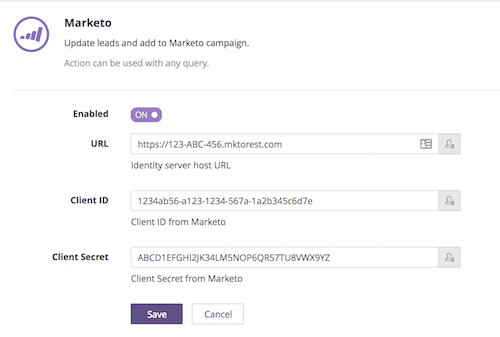
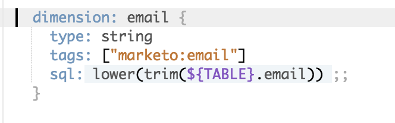

# Marketo

> This action is not currently supported by Looker. Looker is unable to respond to bugs or feature requests for this action. All actions are [open source](https://github.com/looker/actions), so users may attempt to remedy any issues and implement a [custom action](https://docs.looker.com/sharing-and-publishing/action-hub#building_a_custom_action)."

This action takes a query result and uses it to update a set of leads in Marketo, and to edit the leads' memberships in campaigns and lists. 

## SETUP

1. Enable Marketo in your Looker Administration page for Actions (/admin/actions).
    - If you haven't already set up the REST API for your Marketo instance, [do that first](http://developers.marketo.com/rest-api/).
    - Get the endpoint URL for your Marketo API and enter it into the Looker Action Hub. **IMPORTANT: You must remove `/rest` from the end of the address. Only enter the part of the endpoint that looks like `https://123-ABC-456.mktorest.com`.**
    - Get the Client ID and Client Secret for your Marketo API user and enter them in the Looker Action Hub. 
    
2. Tell Looker how columns in Looker map to fields in Marketo.
    - For every dimension/measure that you want Looker to be able to send to Marketo, you must map it in the LookML to a Marketo field.
    - The tag should follow the form `marketo:<marketo field name>` and should use the REST API name that Marketo gives the field. **IMPORTANT: You must use the REST API name of the field, not the display name or SOAP API name.**
    - You can read how to find Marketo API field names [here](https://docs.marketo.com/display/public/DOCS/Export+a+List+of+All+Marketo+API+Field+Names).
    - You can add as many tags as you'd like to a Looker field, as long as it has the Marketo field. 

## USING THE MARKETO ACTION

When you use the Marketo Action in Looker, Looker does two steps in sequence:

1. It upserts lead records in Marketo with any new information. (That is, if a record already exists, it updates it, and if the record does not exist, it creates it.)
2. It optionally adds or removes the lead in the campaign or list you specify

To use this Action, run a query in Looker with all the fields that you want to send to Marketo. This query must contain a lookup field that identifies each record (most commonly email).
    
1. Run a query to generate the rows you want to push to Marketo.
2. Click the gear icon, choose Send..., then choose Marketo as the destination.
3. If you want to use a lookup field other than email, change that field to the REST API name of the lookup field. Otherwise leave it as `email`.
4. Choose whether you want to just update leads, or whether you want to add/remove them to a campaign or list.
5. If applicable, enter the id of the campaign or list for which you'd like to add/remove the leads.
6. If you want to send all rows (and ignore the limit on the query), select "All Results" under Advanced Options.
7. Hit send and let the magic happen.

## THINGS TO KNOW

- Any fields in your query that are not tagged in the LookML will not be sent to Marketo.
- The maximum number of rows you can send will be affected by Marketo's rate limits. The Action has been tested up to 50,000 rows successfully but likely can send more.
- A very common error you may receive is listed on the scheduled jobs page (admin/scheduled_jobs/) and indicates that certain leads were skipped. This looks like `{"skipped":{"Multiple lead match lookup criteria":["test@test.com"]}}` and occurs when a lead you send to Marketo matches multiple leads in the Marketo database. Because Marketo can't tell which of the leads you want to operate on, it skips that lead entirely. All of the other leads that you send will still be processed, but the ones listed in the error will be skipped. To address this error, you must deduplicate the records in Marketo.
- In addition to sending query results to Marketo manually, you can also schedule a Look to send to Marketo automatically. Follow the same procedures above, but under the gear icon, choose Schedule...
