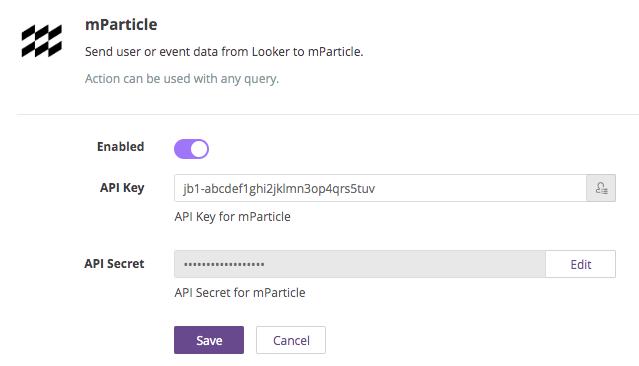
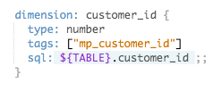

# mParticle
## Send User Identities or Events from Looker to mParticle

The mParticle action allows you to bulk export your user or event data from Looker to mParticle. It looks for tags in the LookML to determine how to shape the body of the POST to the mParticle API. User is required to specify whether the row data is user or event related based on a form in the action, and all rows must contain at least one user identity.

## Setup

1. Enable mParticle in your Looker Administration page for Actions (/admin/actions).
  - Get the API key / secret by setting up the Looker integration via mParticle's partner directory and enter them in the Looker Action Hub. 


2. Tell Looker how columns in Looker map to fields in mParticle.
  - For every dimension/measure that you want Looker to be able to send to mParticle, you must map it in the LookML to an mParticle field. 
  - The naming conventions are summarized in the following tables, with the first value representing the tag to place in the LookML, and the second value representing the associated mParticle field that it will map to.
  - **All rows are required to have at least 1 user identity tag present.** This applies to both user identities and events. Not doing so will result in a failure to send.
  - Any number of user attribute tags can be specified.


### User Profiles
  |LookML tag|mParticle mapping|
  |----------|-----------------|
  |mp_customer_id|user_identities.customerid|
  |mp_email|user_identities.email|
  |mp_facebook|user_identities.facebook|
  |mp_google|user_identities.google|
  |mp_microsoft|user_identities.microsoft|
  |mp_twitter|user_identities.twitter|
  |mp_yahoo|user_identities.yahoo|
  |mp_other|user_identities.other|
  |mp_other2|user_identities.other2|
  |mp_other3|user_identities.other3|
  |mp_other4|user_identities.other4|
  |mp_user_attribute|user_attibute.looker_<name_of_view>.name_of_dimension|


### Events
  |LookML tag|mParticle mapping|
  |----------|-----------------|
  |mp_event_name|event_name|
  |mp_custom_event_type|data.custom_event_type|
  |mp_event_id|data.event_id|
  |mp_timestamp_unixtime_ms|data.timestamp_unixtime_ms|
  |mp_session_id|data.session_id|
  |mp_session_uuid|data.session_uuid|
  |mp_device_info|device_info.<name_of_dimension>|
  |mp_custom_attribute|data.custom_attributes.looker_<name_of_view>.name_of_dimension|

## Using the mParticle Action

1. Run a query to generate the rows you want to send to mParticle.
2. Click the gear icon, choose `Send...`, then choose mParticle as the destination.
3. Select either `User Identities` or `Events` from the dropdown.
4. If you want to send all rows (and ignore the limit on the query), select `All Results` under `Advanced Options`.
5. Hit `Send`.

## Things to Know

- This action POSTs to mParticle's batch API endpoint.
- The endpoint accepts a maximum of 100 rows per batch, so the action streams the rows from Looker and batches them appropriately.
- In addition to sending query results to mParticle manually, you can also schedule a Look to send to mParticle automatically. Follow the same procedures above, but under the gear icon, choose `Schedule...`
- As described in the [mParticle documentation](https://docs.mparticle.com/developers/server/json-reference/#device_info), only certain `device_info` fields are supported. A dimension tagged with `mp_device_info` must have a name from the [list of supported fields](https://docs.mparticle.com/developers/server/json-reference/#device_info). For example, 

```
  dimension: brand {
    type: string
    tags: ["mp_device_info"]
    sql: ${TABLE}.brand_info ;;
  }
```
