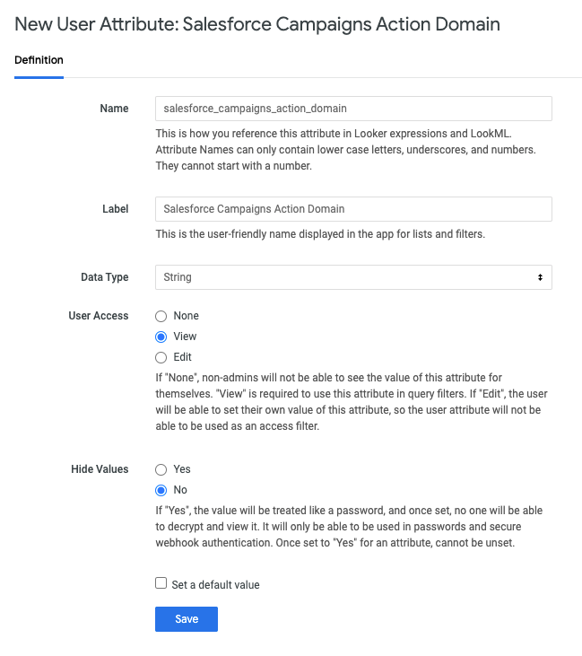
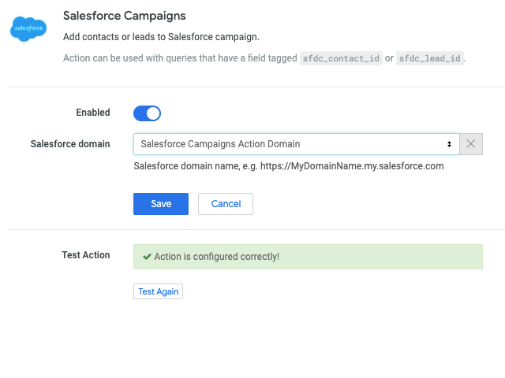
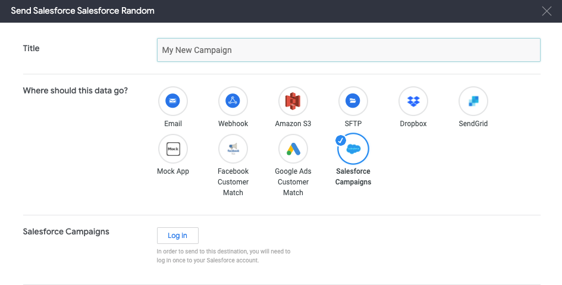
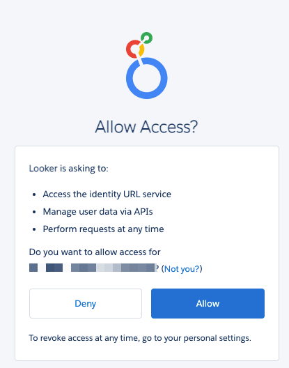
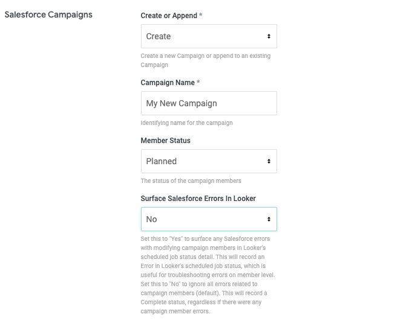
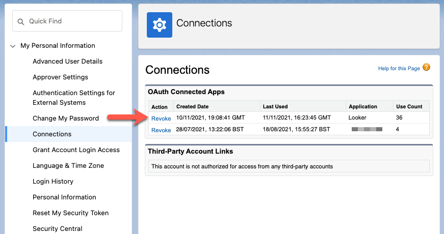

# Salesforce Campaigns

## Send data to Salesforce

For instances on the 22.6 release or later, Looker has created a new integration called Salesforce Campaigns that lets you create campaigns in Salesforce and populate the campaign members with leads and/or contacts. You can choose to create a new campaign, or append users to an existing campaign from Looker.

## Setup Instructions

1. Create a [User Attribute](https://docs.looker.com/admin-options/settings/user-attributes) to control access to the action and specify the Salesforce domain:

   - Name: `salesforce_campaigns_action_domain`
   - Data Type: `String`
   - User Access: `View`
   - Hide Values: `No`
   - No default value
     
     

1. Assign your Salesforce domain (e.g. "https://MyDomainName.my.salesforce.com") as a value to specified users/groups that will use the Action.

   - Different users can target different domains (e.g. a Staging or Development Salesforce instance), and you can update the domain value at any time.
   - Users that do not have an assigned value will not see the action as a destination option.

1. Go to admin/actions, and click `Enable`. Slide the `Enabled` toggle bar to on, and select the `Salesforce Campaigns Action Domain` User Attribute for the "Salesforce domain" parameter. Click Save:

   

1. [Optional] Set up LookML tags `sfdc_contact_id` and `sfdc_lead_id` for contacts and lead fields respectively. Alternatively, the action will attempt to regex match the field label with the following expressions: `/contact id/i` and `/lead id/i` (case insensitive).

## Usage

### OAuth Login Flow

1. From a Look or Explore, create a schedule or select the send data option.
1. Select the Salesforce Campaigns Action.
1. The first time you use the Action you will be prompted to login to Salesforce. Click "Log In":

   
1. This will take you to the OAuth consent screen. Click "Allow":

   
1. You can now return to the send modal in Looker. Click "Verify credentials".

### Action Form Parameters

1. `Create or Append`: Choose to create a new Campaign or append to an existing Campaign
1. `Campaign Name`: Enter the name for the new Campaign or select an existing Campaign
1. `Member Status`: Select the status of the campaign members. This list will be populated from available statuses from your Salesforce instance
1. `Surface Salesforce Errors In Looker`: Set this to "Yes" to surface any Salesforce errors with setting campaign members in Looker's scheduled job status detail. This will record an Error in Looker's scheduled job status, which is useful for troubleshooting errors on a member level. Set this to "No" to ignore all errors related to campaign members (default). This will record a Complete status, regardless if there were any errors setting campaign members.

   

### Removal

If you want to switch the connected Salesforce instance, or, disconnect the Looker Action from your Salesforce instance, you can revoke the connection by going to "My Personal Information" > "Connections" > "OAuth Connected Apps" and then clicking `Revoke` to the Looker Application. You can use the below URL as an example to navigate to:

`https://YOUR_SALESFORCE_DOMAIN.com/ui/setup/personal/ConnectionsSetupPage?setupid=Connections`

## Requirements

- Salesforce API v42.0+ and later (released Spring 2018)
- Users will need "Create" and "Edit" permissions on the Campaigns object (this is associated with the "Marketing User" profile by default) as well as the "Marketing User" checkbox checked on their user profile
- If you do not have sufficient permissions, you may see the following error message: `entity type cannot be inserted...`

## Limitations

- Each Salesforce Edition has a limit to the number of API calls allowed in a 24-hour period. Refer to the [Salesforce API Request Limits and Alloctions](https://developer.salesforce.com/docs/atlas.en-us.salesforce_app_limits_cheatsheet.meta/salesforce_app_limits_cheatsheet/salesforce_app_limits_platform_api.htm) documentation to learn your instance's API limits. This Action leverages POST requests with [sObject Collections](https://developer.salesforce.com/docs/atlas.en-us.api_rest.meta/api_rest/resources_composite_sobjects_collections_create.htm) to execute multiple records (200 records per API call) in a single request.
