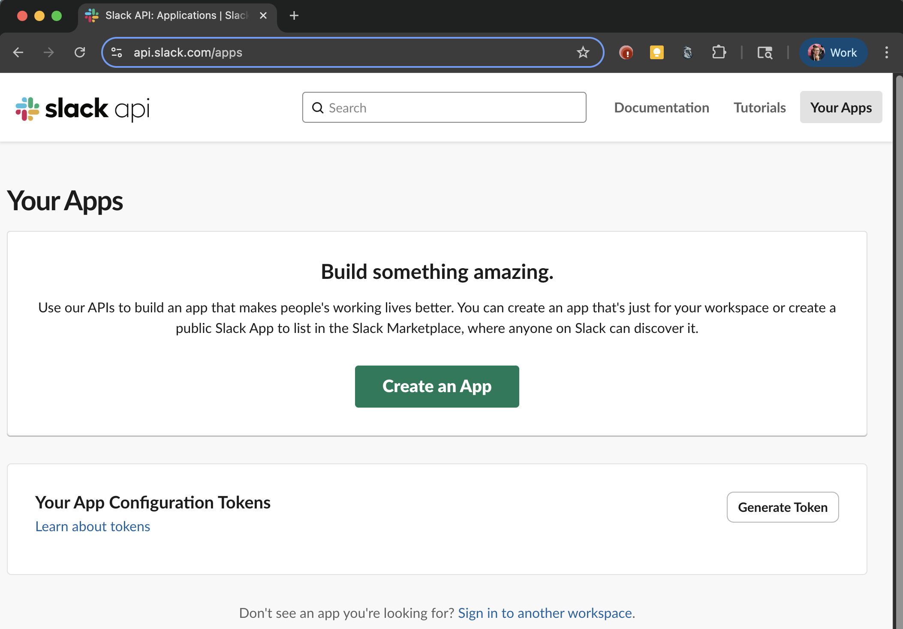
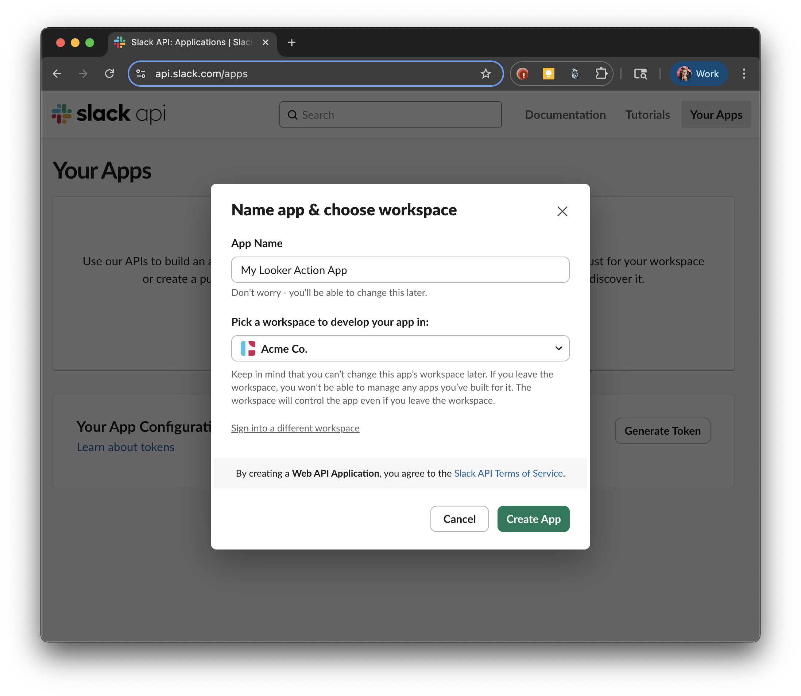
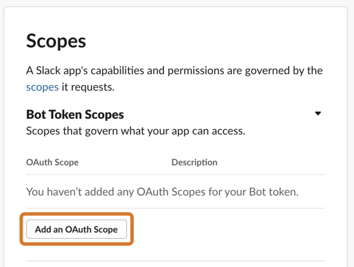
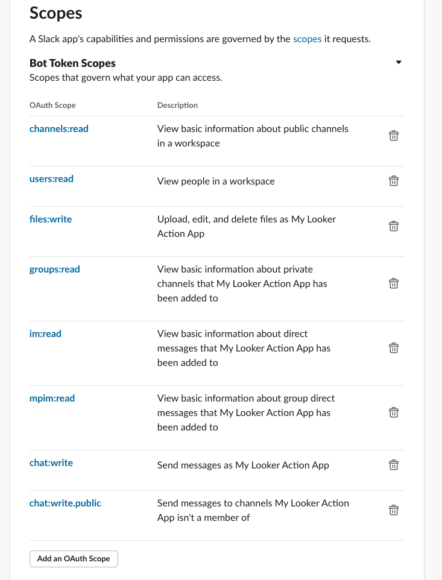
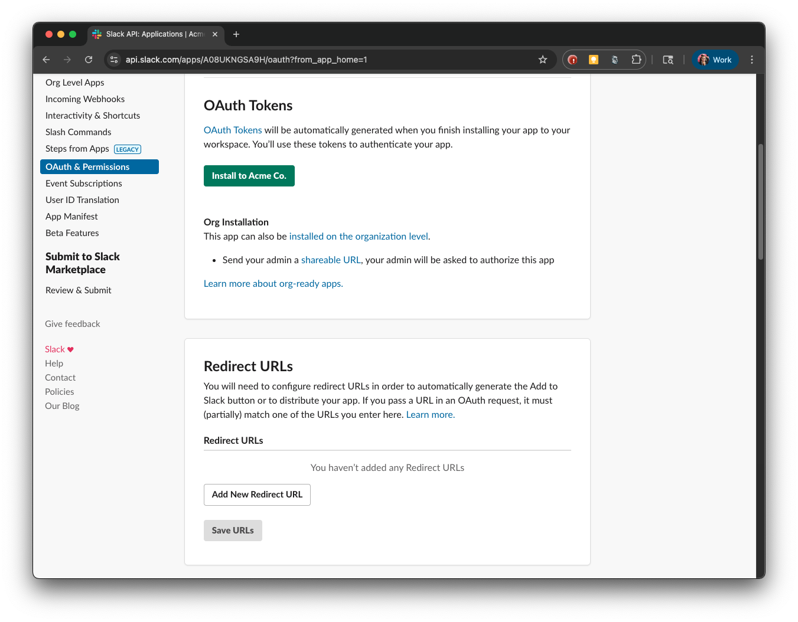
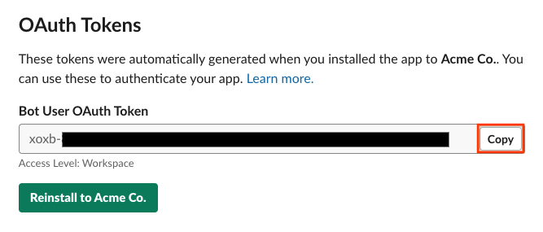

# Slack Attachment (API Token)

   

**This is not an officially supported Google product.**

Perform this action to post an attachment with your Looker data to a public or private Slack channel or to a direct message (DM).

To use this action, you'll create an action app in the [api.slack.com](https://api.slack.com) interface that is tied to your Slack workspace and then configure a bot user from which the action will post the attachments by using the appropriate API token for that "user."

> [!IMPORTANT]  
> ## Remember to invite the bot user to any channels or groups that you might want to send data to!

## Generating a Bot User Token in a Private Slack Action Application

1. Go to the Slack API app page at [https://api.slack.com/apps](https://api.slack.com/apps).

   

2. Click **Create An App**. If a dialogue pops up asking whether to create app from a manifest or from scratch, select **From scratch**. Enter a name for your app in the **App Name** field and select your company's Slack workspace from the **Development Slack Workspace** drop-down.

   

3. Once the app is created, click on the name of your app to open a page that allows you to further customize your app. Make sure your action app is selected in the drop-down in the upper left corner.

4. Click the **App Home** tab in the sidebar. Click **Review Scopes to Add** to configure the scopes for your action app's bot token. (According to the Slack documentation, a [bot user token](https://api.slack.com/authentication/token-types#bot) represents a bot associated with the app installed in a workspace. New bot users can request individual scopes, similar to user tokens. Unlike user tokens, bot user tokens are not tied to a user's identity; they're just tied to your app.)

5. On the **Oauth & Permissions** tab, scroll down to the **Scopes** section. Under **Bot Token Scopes**, click **Add an OAuth Scope**.

   

From the drop-down of OAuth scopes, select:

    * `channels:read`
    * `users:read`
    * `files:write`
    * `groups:read`
    * `im:read`
    * `mpim:read`
    * `chat:write`
    * `chat:write.public`

   

> For more information about exactly what these permissions allow the Looker action to do, visit the documentation for each of them: 
> - [https://api.slack.com/scopes/channels:read](https://api.slack.com/scopes/channels:read)  
> - [https://api.slack.com/scopes/users:read](https://api.slack.com/scopes/users:read)  
> - [https://api.slack.com/scopes/files:write](https://api.slack.com/scopes/files:write)  
> - [https://api.slack.com/scopes/groups:read](https://api.slack.com/scopes/groups:read)  
> - [https://api.slack.com/scopes/im:read](https://api.slack.com/scopes/im:read)  
> - [https://api.slack.com/scopes/mpim:read](https://api.slack.com/scopes/mpim:read)  
> - [https://api.slack.com/scopes/chat:write](https://api.slack.com/scopes/chat:write)  
> - [https://api.slack.com/scopes/chat:write.public](https://api.slack.com/scopes/chat:write.public)  

6. At the top of the **OAuth & Permissions** page, click **Install App to Workspace**.

   

7. Click **Allow** to allow your Slack workspace to use your newly created app.

8. At the top of the **OAuth & Permissions** page, copy the **Bot User OAuth Access Token**.

9. Enable the Slack Attachment (API Token) action in your Looker instance on the **Actions** page on the **Admin** panel. Paste in the token you copied.

> [!IMPORTANT]  
> ## Remember to invite the bot user to any channels or groups that you might want to send data to!

See the [Sending Looker content to Slack with the Slack Attachment (API Token) integration](https://cloud.google.com/looker/docs/best-practices/how-to-use-the-looker-slack-attachment-api-token-action) documentation for information about how to send or schedule data deliveries to the Slack Attachment (API Token) action.
