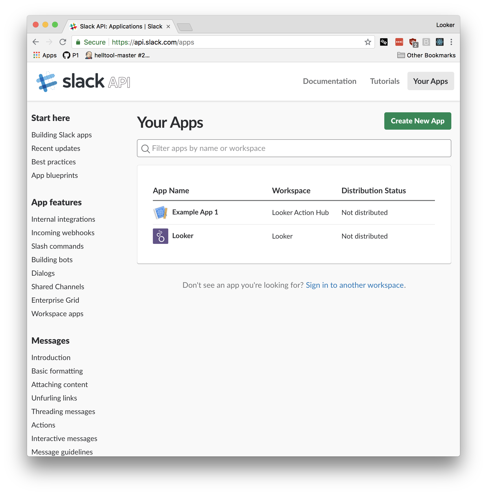
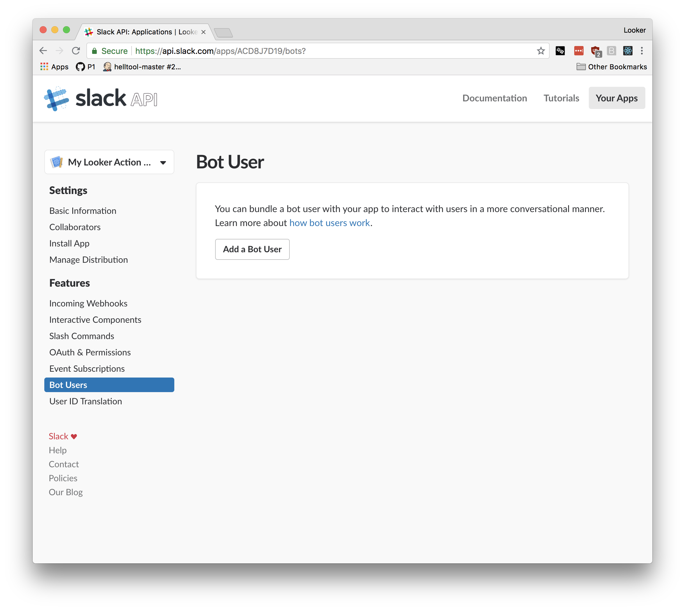
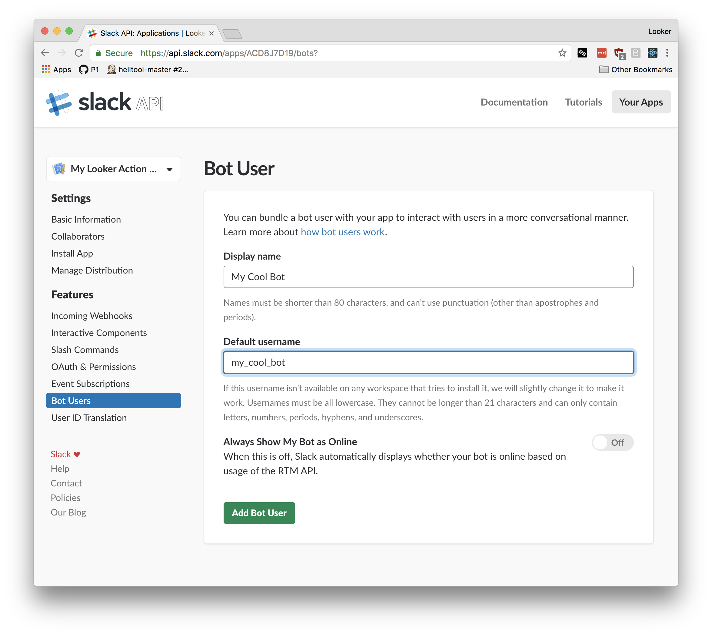
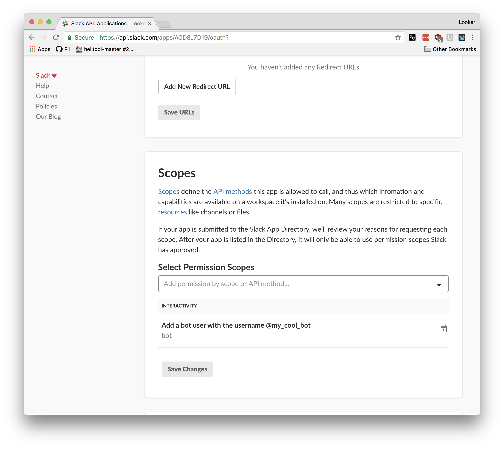
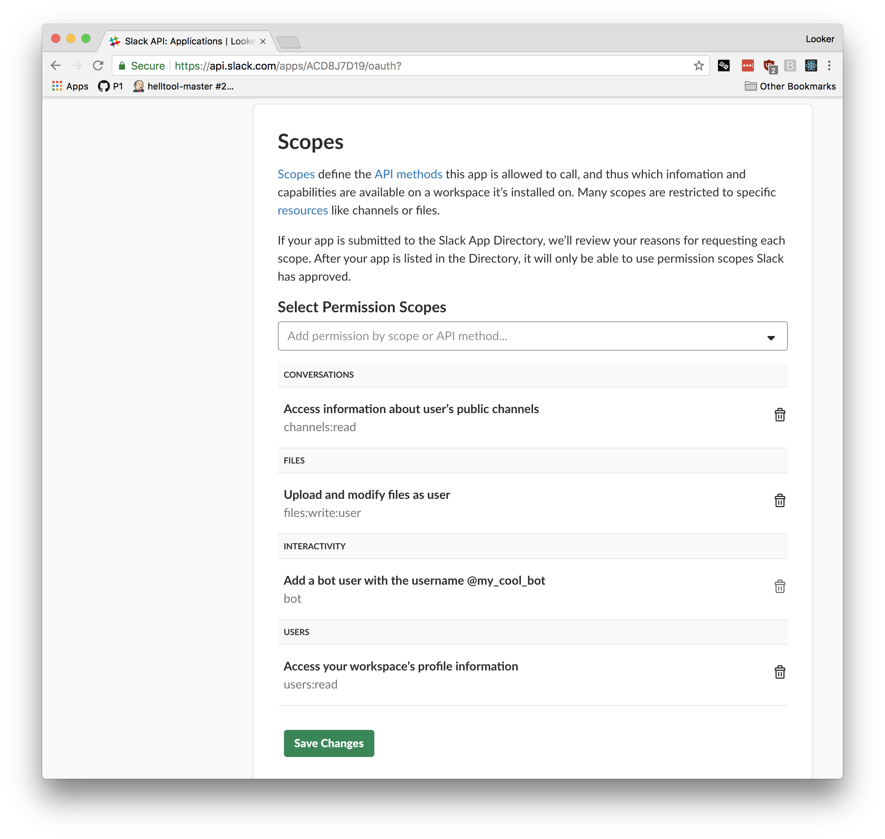
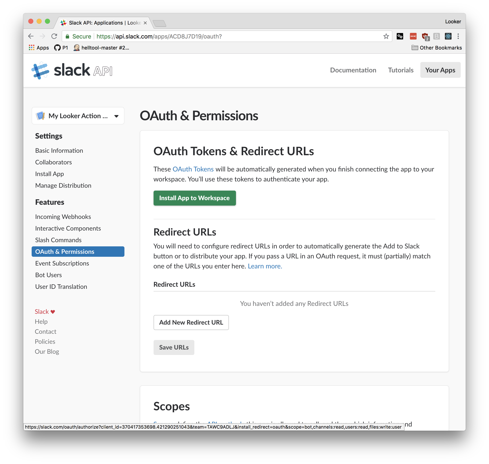
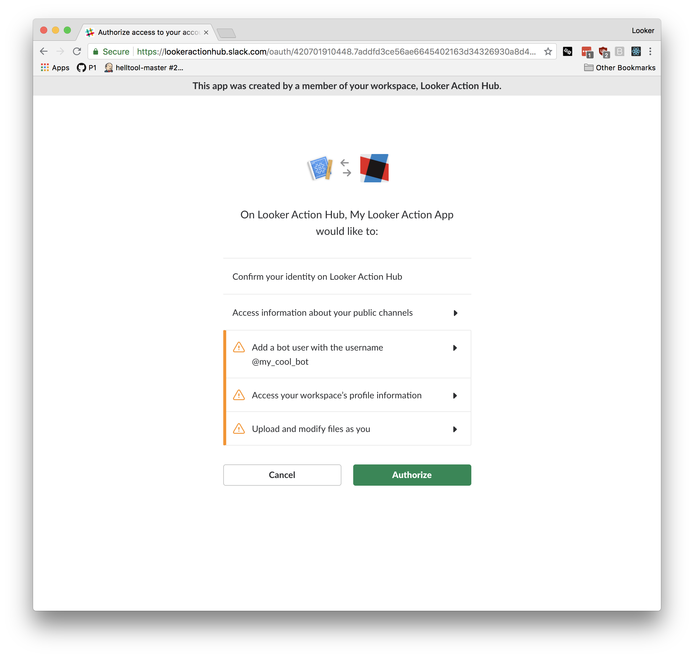
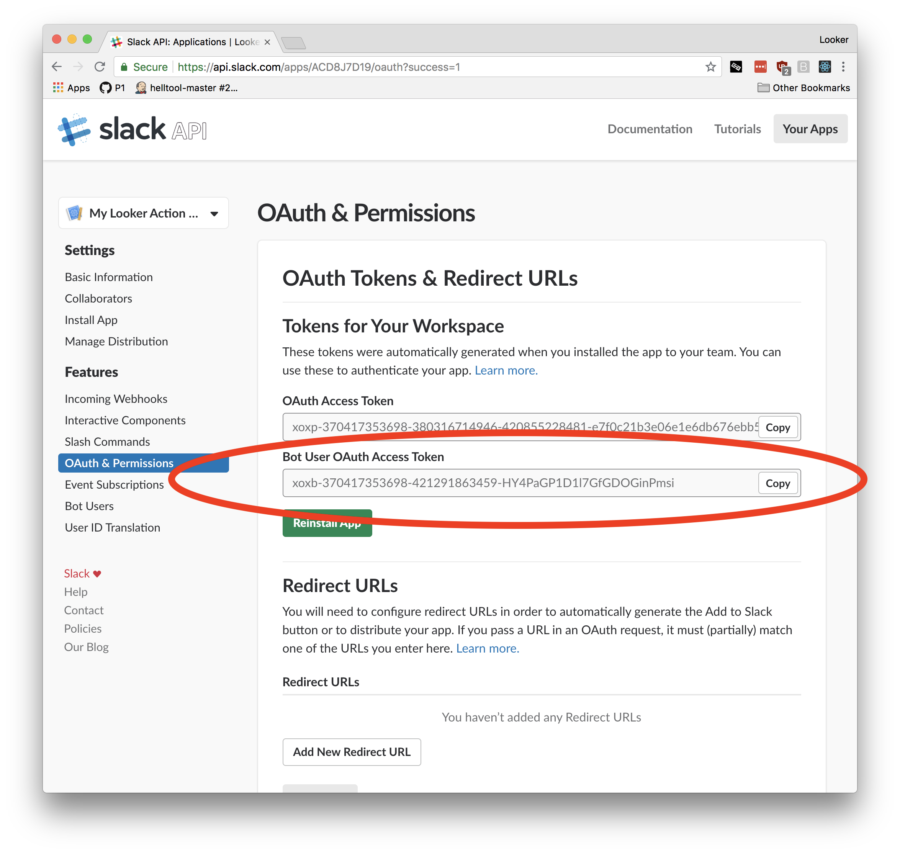
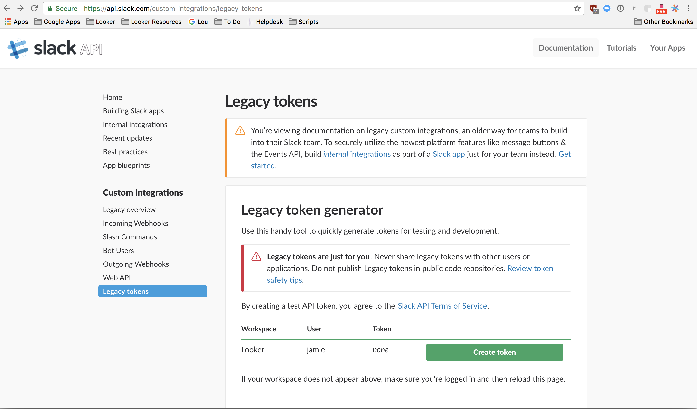
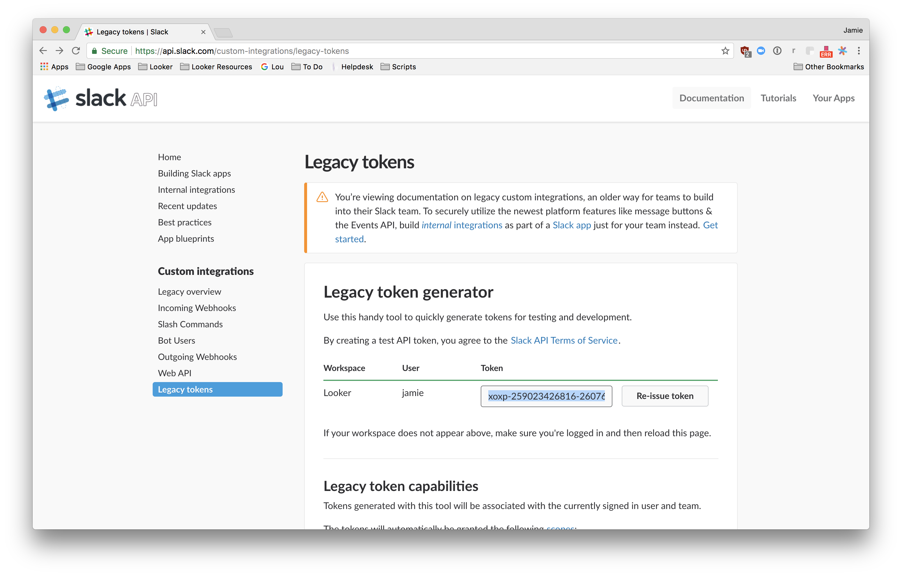

# Slack Attachment

This action will post an attachment with your Looker data to a public Slack channel or direct message (DM).

You can configure which user (usually a bot user) the action will post the attachments by using the appropriate API token for that user.

## Getting Slack Credentials

There are 2 ways of getting Slack credentials for use with this action.

1. Bot user in a private Slack application (recommended)
2. Slack legacy token

### Bot user in a private Slack application

1. Go to the Slack app creation page at https://api.slack.com/apps

    

2. Click "Create New App" and enter an App Name and choose your company's Slack workspace for "Development Slack Workspace".

    

3. Once the app is created, go to the "Bot Users" tab in the sidebar and click "Add a Bot User".

    

4. Enter a name and username for your bot user. This is the user that Looker will send data as.

    

5. On the sidebar, visit the "OAuth & Permissions" tab and scroll down to the "Scopes" section.

    

6. In the text box for "Add permission by scope or API method" add the following scopes:

    - `channels:read`
    - `users:read`
    - `files:write:user`

    > For more information about exactly what these permissions allow the Looker action to do, visit the documentation for each of them:
    > - https://api.slack.com/scopes/channels:read
    > - https://api.slack.com/scopes/users:read
    > - https://api.slack.com/scopes/files:write:user

    When you're done it should look like this:

    

    Select "Save Changes".

7. At the top of the "OAuth & Permissions" page click "Install App to Workspace".

    

8. Click "Authorize" to allow your Slack workspace to use your newly created app.

    

9. At the top of the "OAuth & Permissions" page copy the "Bot User OAuth Access Token".

    

10. Enable Slack in Looker on the Actions page (/admin/actions) and use the token you copied.

Note: Remember to invite the looker bot to any channels or groups that you might want to send data to!

### Legacy Token

Legacy tokens aren't reccomended since they expose more permissions than neccessary for the Looker action to work. However, you can use a legacy token as your API token for this action if you need to for some reason. The legacy token will post as yourself on Slack rather than a bot account.

1. Go to your Slack [action token page](https://api.slack.com/custom-integrations/legacy-tokens).

    

2. Select Create token

    

3. Copy Token

4. Enable Slack in Looker on the Actions page (/admin/actions) and use the token you copied.
