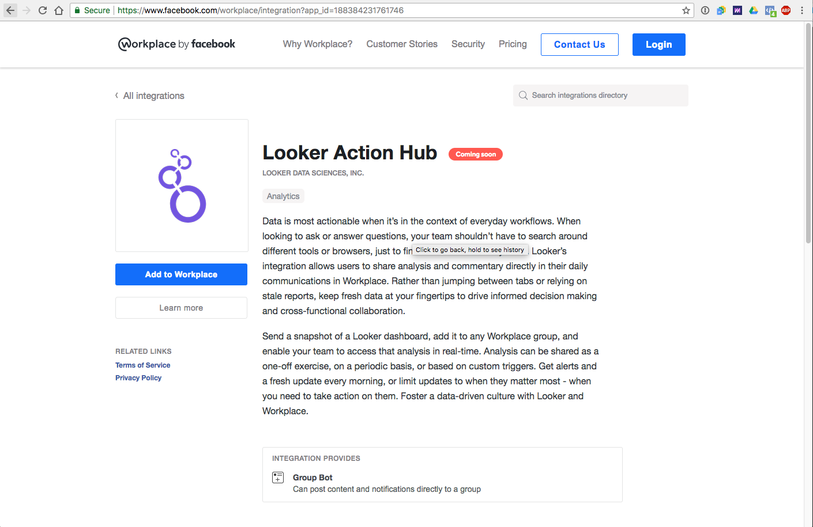
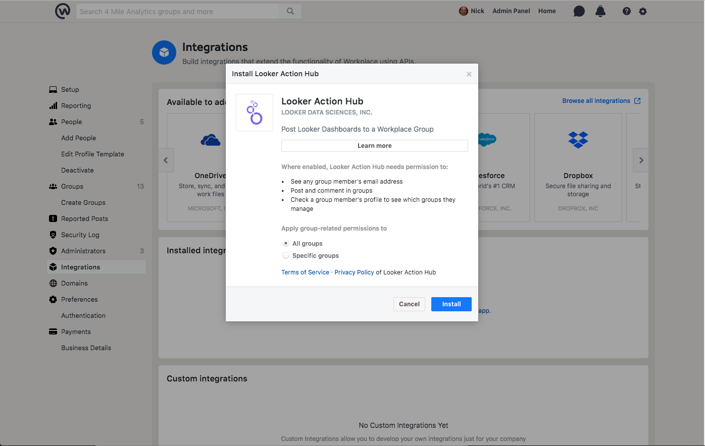
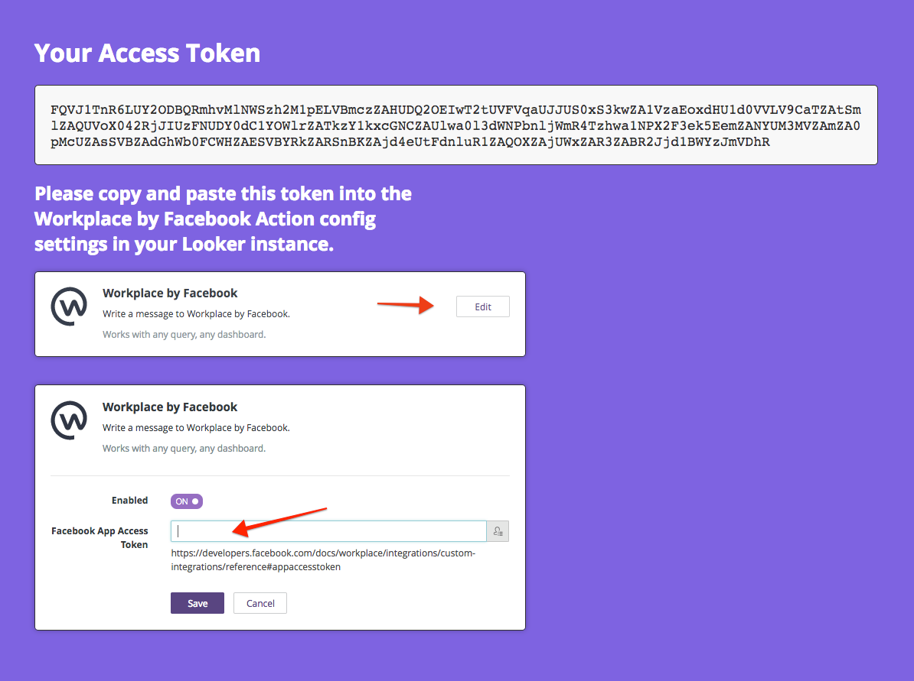
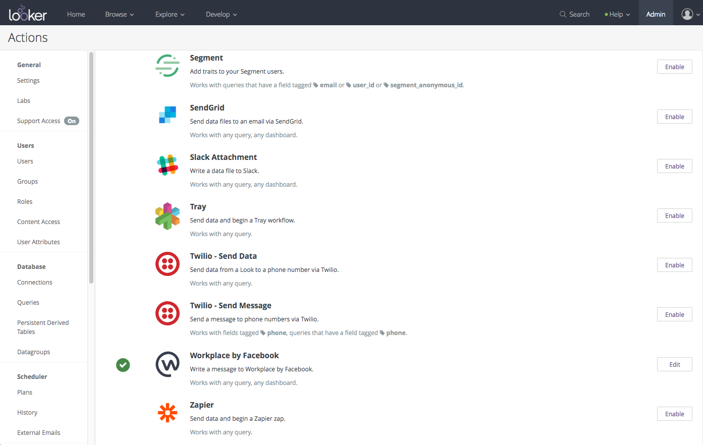
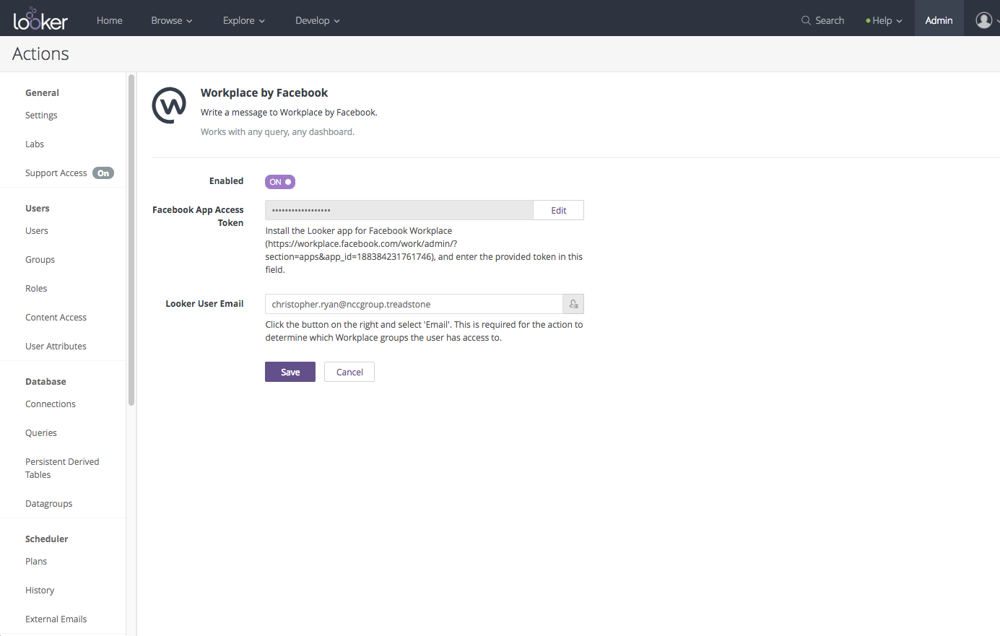

# Workplace by Facebook
## Send a message to a Workplace by Facebook group referencing Looker data

This action will send a Looker dashboard preview and link to a Workplace by Facebook group through a Workplace by Facebook app: Looker Action Hub.

### Installation Instructions:

1. Navigate to Workplace by Facebook's [Looker Action Hub app page](https://www.facebook.com/workplace/integration?app_id=188384231761746).

 

2. Click "Add to Workplace"

3. On the modal that pops up, click "Install"

 

4. A new window will open displaying an access token.  Select and copy the access token into your clipboard.

 

5. Navigate to Actions admin page on your looker instance at [YOUR COMPANY NAME].looker.com/admin/actions. 

6. Locate the Workplace by Facebook action hub integration, and click "Edit"

 

7. Next to the field labelled "Facebook App Access Token", click "Edit".  Then paste the access token you copied from the earlier step into the text field.

 

8. If you wish all Looker posts on Workplace to show as coming from a single author, enter that Looker user's email into the field "Looker User Email".  If you wish each Workplace post to show the author as the Looker user who sent it, click the _person_ icon on the right hand side of the "Looker User Email" field, and select "Email" from the drop down list.

> 	Note: The Looker user's email address must match their Facebook account's email address for the integration to function correctly.
