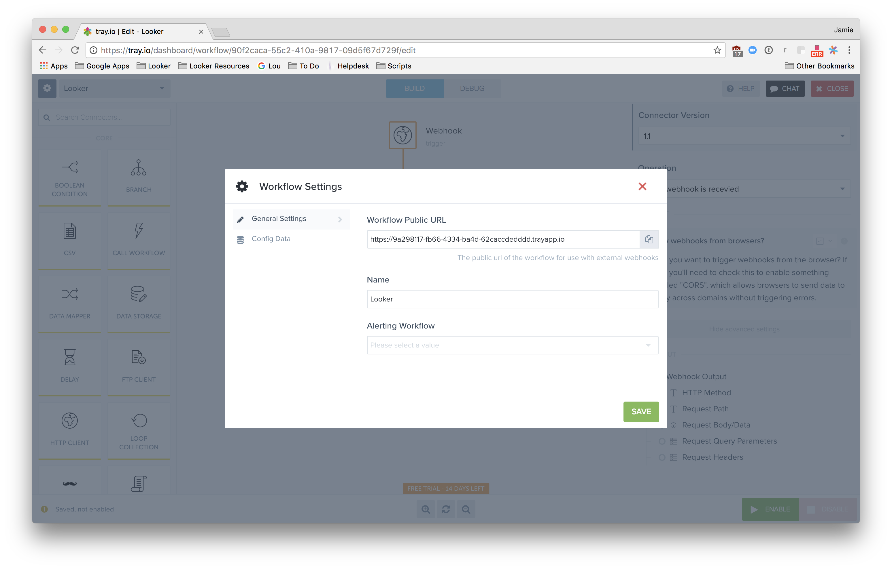

# Tray

Go to your Tray [home page](https://tray.io/dashboard).

Select Create Workflow

Add Webhook Connector

Far right Settings Gear -> Copy Workflow Public URL

Enable Tray in your /admin/integrations
Use the copied webhook URL in Send or Schedule to Tray
Build out your Workflow using Looker data!
