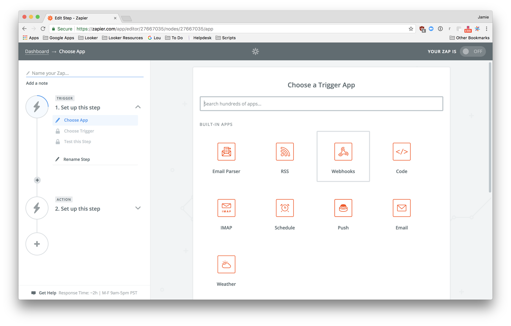

# Zapier

Go to your Zapier [home page](https://zapier.com/app/explore).

Create Zap

Select Webhook Trigger and select Catch Hook

Copy Webhook URL

Enable Zapier in your /admin/integrations
Use the copied webhook URL in Send or Schedule to Zapier
Build out your Zap using Looker Data
